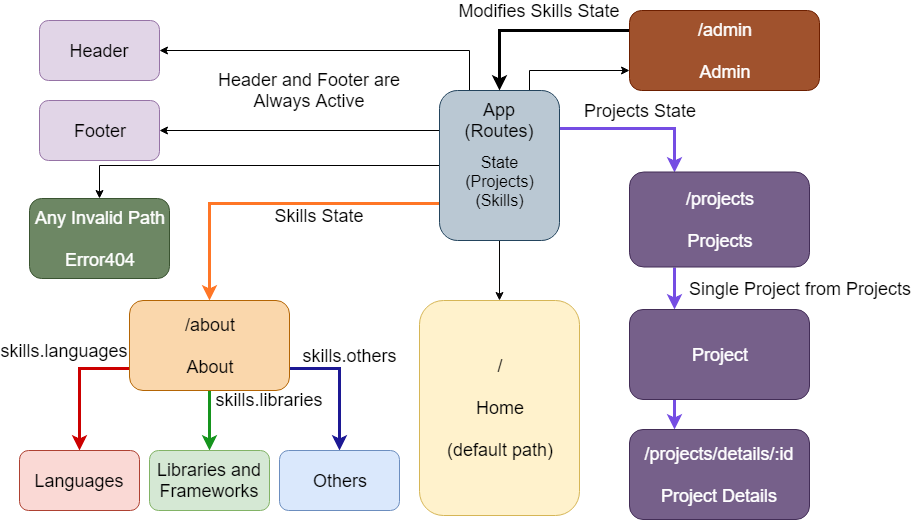

# _Alex Williams_

#### _A portfolio website showcasing projects, skills, and details about me, 2/15/2019_

#### By _**Alex Williams**_

## Description

_This web application is designed as a portfolio for myself, Alex Williams. It contains routes for pages such as Projects, and About me. It showcases some of my projects that I currently have on github, and my skills as a web developer._

## Component Structure

The main component structure consists of App, Home, About, Footer, Header, Project, Projects, and Error404.

## About Page 
About page has small paragraph about myself, and a list of related skills contained in cards.

## Projects Page
Projects page shows all my major projects that I have completed individually and in a group.

## Setup/Installation Requirements

* _Clone from Github_
* _Locate project root directory and run "npm i" in console to install dependencies._
* _Type "npm run start" to launch the application._
* _Navigate to localhost:8080 to see the project on the local host server._

_No live servers required for this project. All client hosting is currently done via localhost:8080 port._

## Known Bugs

_No known bugs_

## Support and contact details

_Contact me at Zizzs17@gmail.com if you have any information or suggestions._

## Technologies Used

_React, React-Router, Javascript, Webpack, Babel, JSX, JSX Styling_

### License

*MIT License*

Copyright (c) 2019 **_Alex Williams_**